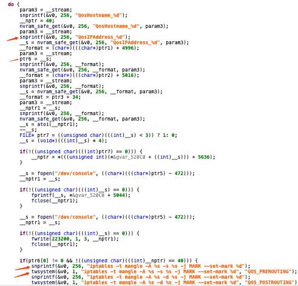
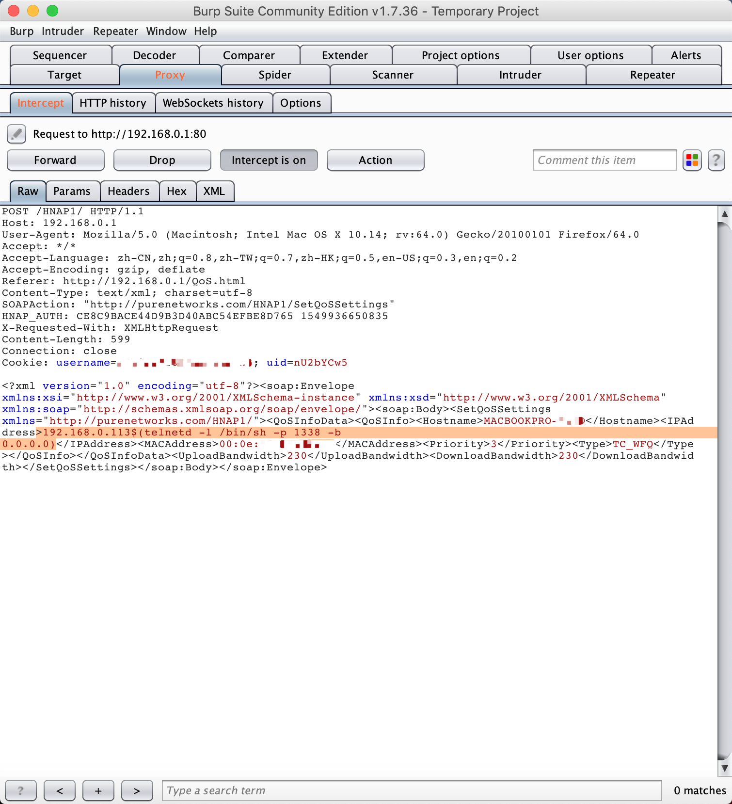
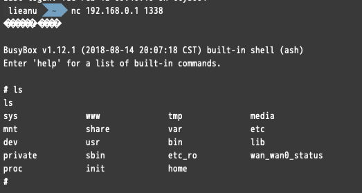

# D-Link SetQoSSettings CMD Injection

Product: D-Link DIR-878(Refer: http://www.dlink.com.cn/home/product?id=2961&hid=27)

Version: The latest firmware -- 1.12(Download Link: http://support.dlink.com.cn/ProductInfo.aspx?m=DIR-878)

Vulnerability Type: Command Injection

Institution: 360 ESG / Legendsec Information Technology(Beijing)Inc.

## Vulnerability Description

A command Injection vulnerability allows attackers to execute arbitrary OS commands via a crafted /HNAP1 POST request. This occurs when any HNAP API function triggers a call to the system function with untrusted input from the request body for the `SetQoSSettings` API function (need authentication).

In `librcm.so` library:

**Qos_init_sw_rules** method:

The value of `QosIPAddress_%d` is not correctly checked.

## POC

