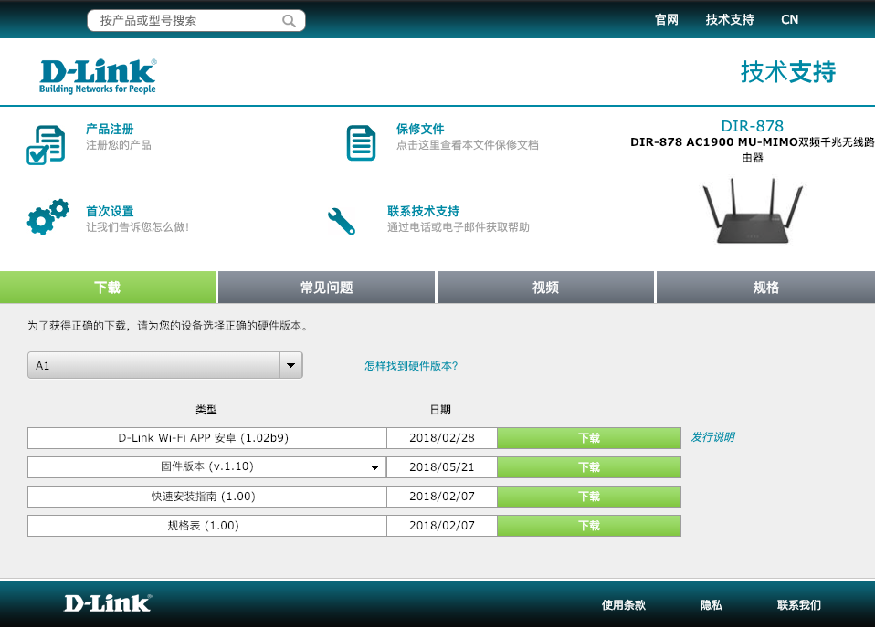
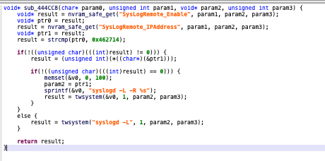
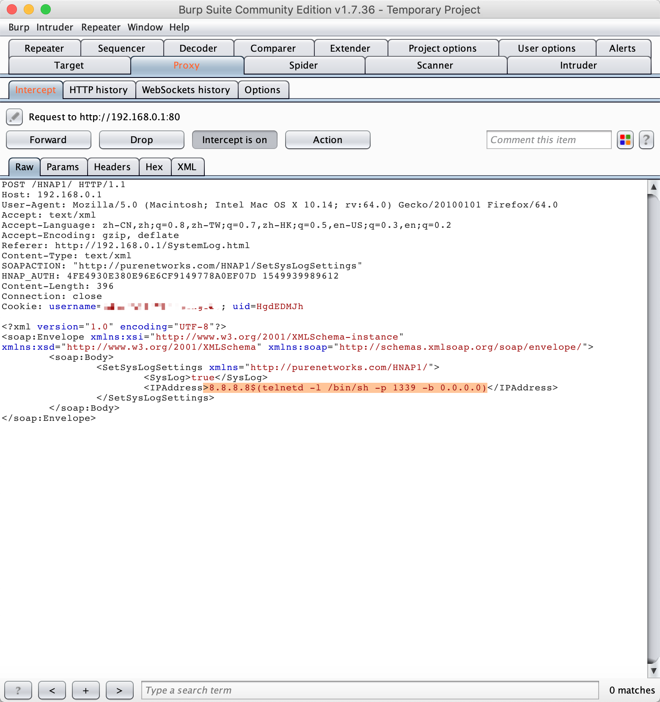
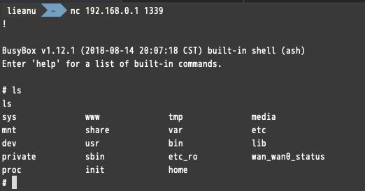

# D-Link SetSysLogSettings CMD Injection

Product: D-Link DIR-878(Refer: http://www.dlink.com.cn/home/product?id=2961&hid=27)

Version: The latest firmware -- 1.12(Download Link: http://support.dlink.com.cn/ProductInfo.aspx?m=DIR-878)

Vulnerability Type: Command Injection

Institution: 360 ESG / Legendsec Information Technology(Beijing)Inc.

## Vulnerability Description

A command Injection vulnerability allows attackers to execute arbitrary OS commands via a crafted /HNAP1 POST request. This occurs when any HNAP API function triggers a call to the `twsystem` function with untrusted input from the request body for the `SetSysLogSettings` API function (need authentication).

In `/bin/rc` binary.

This method will execute `syslogd -L -R x.x.x.x`，x.x.x.x should be a valid ipv4 address, but this is not strictly checked, you can pass any payload (such as `$(telnetd -l /bin/sh -p 1339 -b 0.0.0.0)`).

## POC

