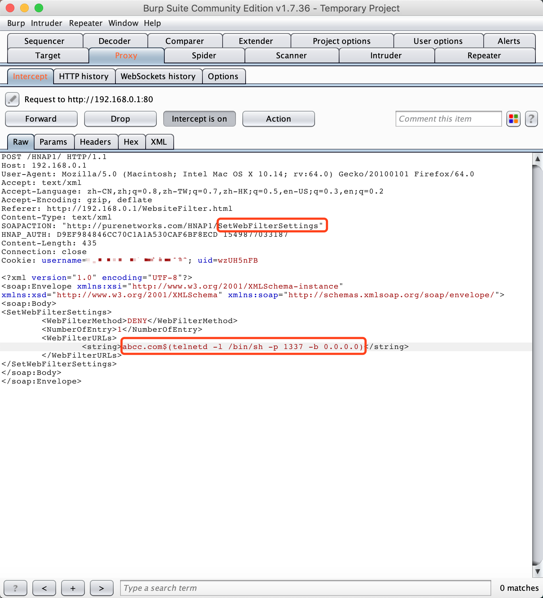
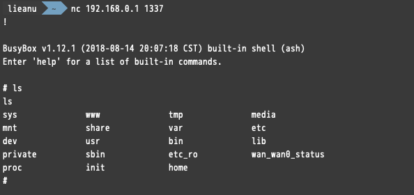

# D-Link SetWebFilterSettings CMD Injection

Product: D-Link DIR-878(Refer: http://www.dlink.com.cn/home/product?id=2961&hid=27)

Version: The latest firmware -- 1.12(Download Link: http://support.dlink.com.cn/ProductInfo.aspx?m=DIR-878)


Vulnerability Type: Command Injection

Institution: 360 ESG / Legendsec Information Technology(Beijing)Inc.

## Vulnerability Description

A command Injection vulnerability allows attackers to execute arbitrary OS commands via a crafted /HNAP1 POST request. This occurs when any HNAP API function triggers a call to the system function with untrusted input from the request body for the `SetWebFilterSettings` API function (need authentication).


In `librcm.so` library:

**tw_add_url_filter_iptables_rule** method:
```
snprintf(&v0, 256, "iptables -t filter -I URL_FILTER -p tcp \t\t-m string --algo bm --string %s -j REJECT --reject-with tcp-rst 2>/dev/null", ptr1);
return twsystem(&v0);
```

**tw_add_url_allow_filter_iptables_rule** method

```
snprintf(&v0, 256, "iptables -t filter -I URL_FILTER -p tcp \t\t-m string --algo bm --string %s -j RETURN 2>/dev/null", ptr1);
return twsystem(&v0);
```

The ptr1 variable is from request body, and when system function is called.

## POC



This will triger the **tw_add_url_filter_iptables_rule** method, and then get a shell! 

If change the value of `WebFilterMethod` to `ALLOW`, it will triger the **tw_add_url_allow_filter_iptables_rule** method, also will get a shell.



