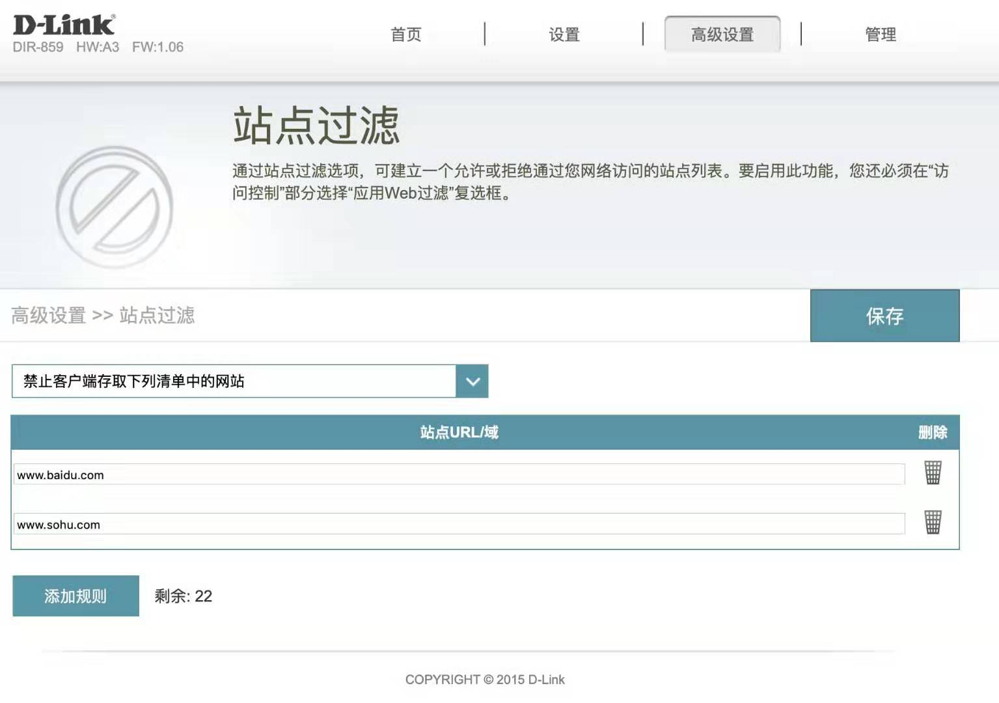
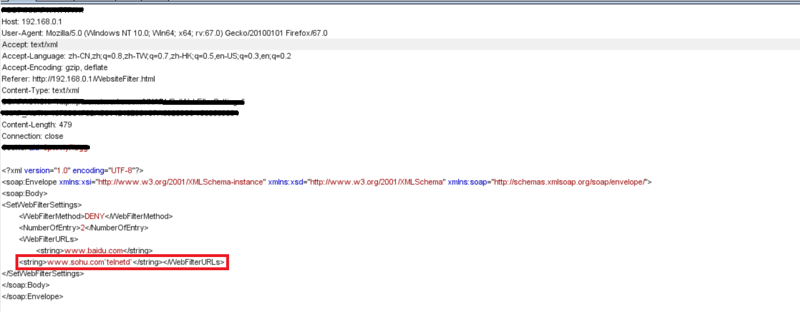
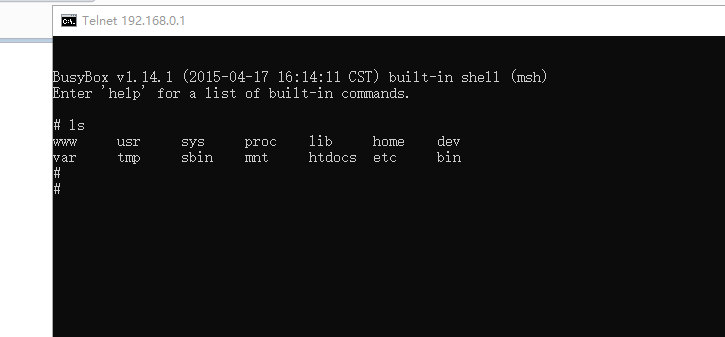
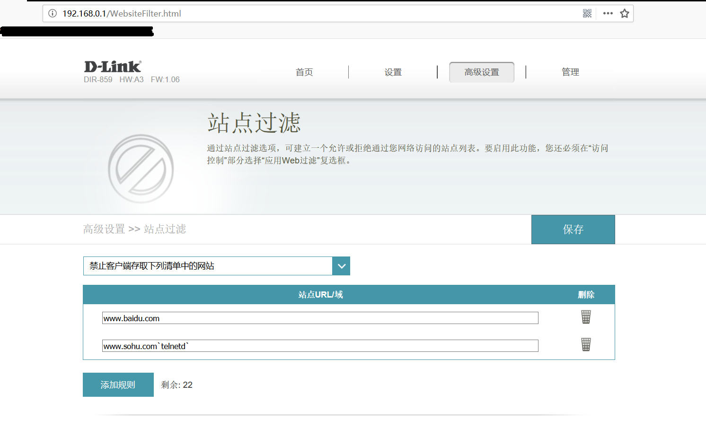

# DIR-859 CMD Injection
Vulnerability for D-Link Router

Product: D-Link DIR-859  (Refer: http://www.dlink.com.cn/home/product?id=2960)

Version: The latest firmware -- 1.06B01 (Download link: https://support.dlink.com/productinfo.aspx?m=DIR-859)


Vulnerability Type: Command Injection

Author: David Chen

Institution: Technology Research Institute of Legendsec at Qi'anxin Group

Vulnerability description
-------------------------
An issue was discovered on D-Link DIR-859 devices with firmware through 1.06B01. A command Injection vulnerability allows attackers to execute arbitrary OS commands via shell metacharacters in a crafted /HNAP1 request. This occurs when the WebFilterMethod function calls the system function with an untrusted input parameter named WebFilterURLs. Consequently, an attacker can execute any command remotely when they control this input. The details are as below:

```xml
<?xml version="1.0" encoding="UTF-8"?>
<soap:Envelope xmlns:xsi="http://www.w3.org/2001/XMLSchema-instance" xmlns:xsd="http://www.w3.org/2001/XMLSchema" xmlns:soap="http://schemas.xmlsoap.org/soap/envelope/">
<soap:Body>
<SetWebFilterSettings>
 <WebFilterMethod>DENY</WebFilterMethod>
 <NumberOfEntry>2</NumberOfEntry>
 <WebFilterURLs>
  <string>www.baidu.com</string>
 <string>www.shohu.com`telnetd`</string></WebFilterURLs>
</SetWebFilterSettings>
</soap:Body>
</soap:Envelope>
```

The "WebFilterURLs" parameter is a string formed as bleow:

```xml
<string>www.baidu.com</string>
<string>www.sohu.com`telnetd`</string>
```
So if someone can POST data like this, they will execute command "telnetd" at the router.

POC
-------------------------

Step1: Attacker need to call "SetWebFilterSettings" fuction that setting "WebFilterURLs" value, so to add URLs at the web page as below:




Step2: To modify the "WebFilterURLs" value, Attacker need to intercpet at BurpSuite after they type "Save" button, and insert command "telnetd" to the parameter as below:



Step3: After sending POST packet as above, this PoC can result in a RCE that executes a "telnetd" command at router as below:



After that, command has already been added to the URLs, you can't do this at web page directly.



P.S. Given the vendor's security, we only provide parts of this exploit.
