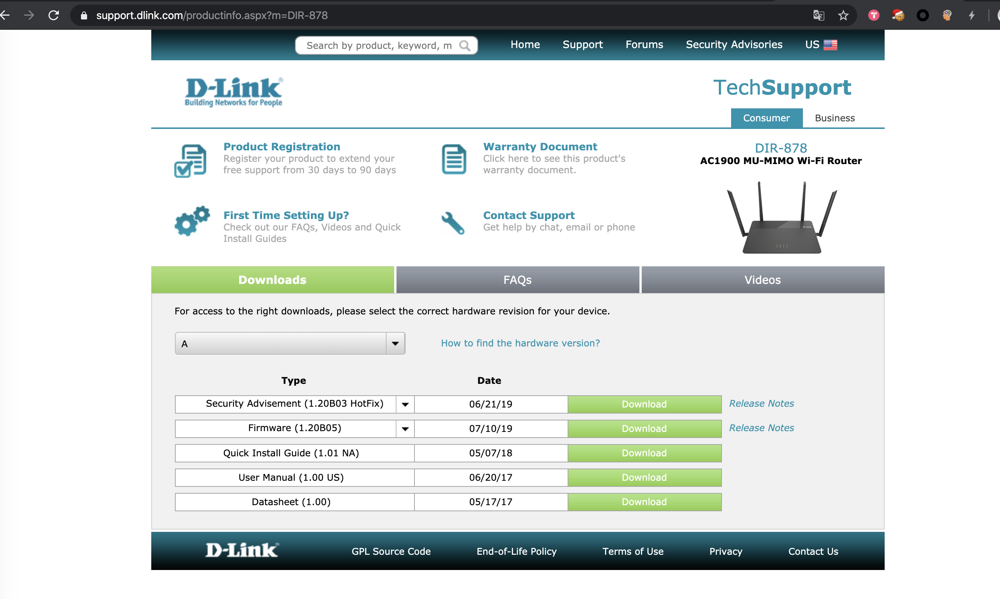
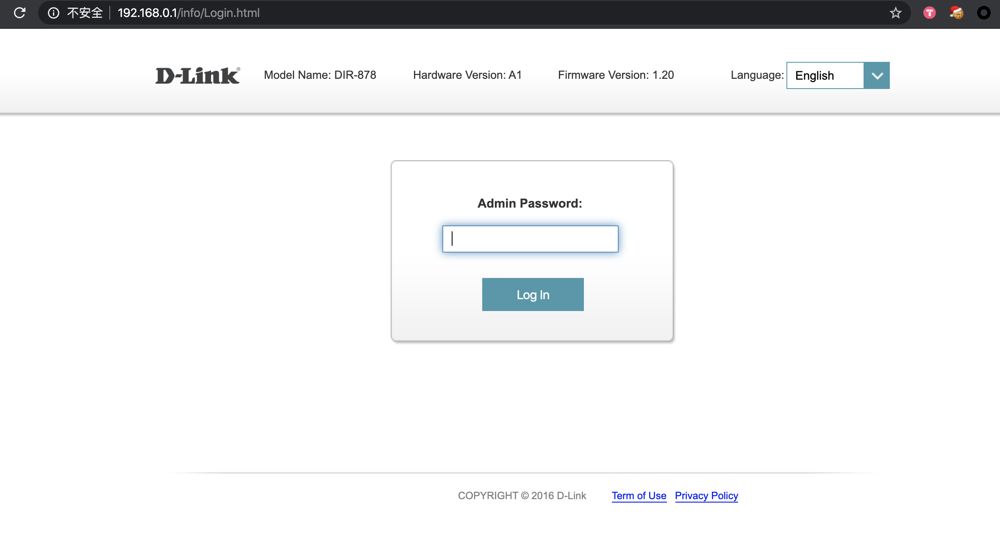

## D-Link Routers Command Injection
### Info
Demo product: D-Link DIR-878 (Refer: [https://support.dlink.com/productinfo.aspx?m=DIR-878](https://support.dlink.com/productinfo.aspx?m=DIR-878))  
Version: The latest firmware -- 1.20B05 (Refer: [https://support.dlink.com/productinfo.aspx?m=DIR-878](https://support.dlink.com/productinfo.aspx?m=DIR-878))  

Vulnerability Type: Command Injection  
Affected versions: DIR-878(newest), DIR-882(newest), DIR-867(newest)  
Author: c014 of sjtu  

 
### POC
There are some filters in front end, we can use burpsuite to bypass it.

When we click `save`, it will generate 2 requests, the first one is an authentication. We need to `Forward` it quickly or we will get a "no device found" error.

Then add evil command here:

Then we can see changed successfully:

Finally getshell:

