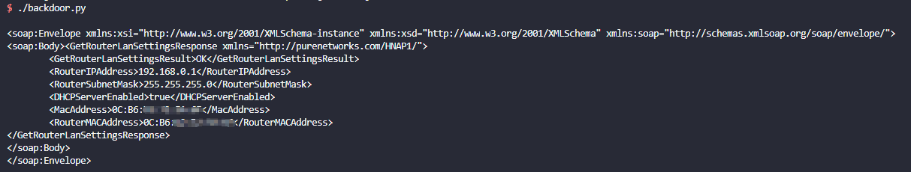

# D-Link DIR series Backdoor to Admin Panel
**Vendor**: D-Link

**Product**:

- DIR-882 http://support.dlink.com.cn/ProductInfo.aspx?m=DIR-882 （equivalent US model: https://support.dlink.com/ProductInfo.aspx?m=DIR-882-US )
- DIR-878 https://support.dlink.com/ProductInfo.aspx?m=DIR-878
- DIR-867 http://support.dlink.com.cn/ProductInfo.aspx?m=DIR-867 （equivalent US model: https://support.dlink.com/ProductInfo.aspx?m=DIR-867-US )
- DIR-853 http://www.dlinktw.com.tw/techsupport/ProductInfo.aspx?m=DIR-853

**Firmware Version**:

All versions are latest and can be downloaded at https://tsd.dlink.com.tw/downloads2008detail.asp

- DIR-882 v1.20B06
- DIR-878 v1.20B05
- DIR-867 v1.10B04
- DIR-853 v1.1

**Vulnerability Type**: Incorrect Access Control

**Author**: tkmk

**Institution**: Shanghai Jiao Tong University

Vulnerability description
-------------------------
A backdoor was discovered on multi D-Link DIR series devices. Using the backdoor, attackers can login as admin without knowledge of the password.

POC
-------------------------

The authentication of admin login is two-step challenge-response authentication. Normally, the client requests for the challenge from the server, performs HMAC with real password and the challenge, sends the result of HMAC back to the server.

If a secret parameter `PrivateLogin=Username` is added when requesting for the challenge, the server will change admin password in this session. Then attackers can use fake password to pass the second step, and gain the privilege of admin.

Refer to [backdoor.py](./backdoor.py) for more details. In this script, we try to login with a fake password by both normal way and backdoor way, and then try to access some information. Only the backdoor way will succeed.

